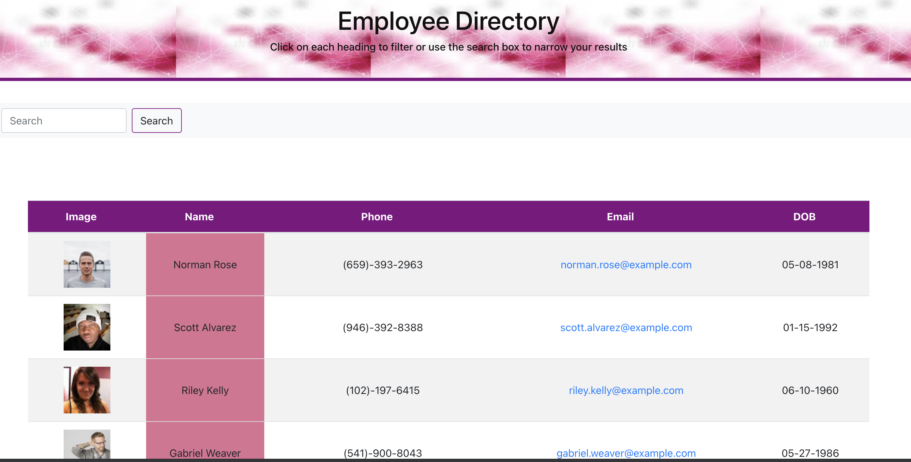

# Employee Directory
## Description

I have created a employee directory with React. In this application requires to break application's UI into components, manage component state, and respond to user events.
## User Story

As a user, I want to be able to view my entire employee directory at once so that I have quick access to their information.
## Business Context

An employee or manager would benefit greatly from being able to view non-sensitive data about other employees. It would be particularly helpful to be able to filter employees by name.
## Table of Contents:

* [Usage](#usage)
* [Installation](#installation
* [Deployment](deployment)
* [License](#license)
* [Questions](questions)

## Usage:

When the user navigates to the page they are presented with a table of employees listing names, emails and profile pictures.The user can view the table as is or search by name.The user can also click the first name or email header to sort the table alphabetically.

The user should be able to:

  * Sort the table by at least one category

  * Filter the users by at least one property.

## Installations:

Given a table of random users generated from the [Random User API](https://randomuser.me/), when the user loads the page, a table of employees should render.
## Deployment:

You are required to submit the following:

* the URL to the deployed application

https://kajalpatel20.github.io/employee_dir/

* the URL to the Github repository

https://github.com/kajalpatel20/employeeDir

## License:
 APACHE 2.0

  []
## Questions:

The repo for this project can be found here

https://github.com/kajalpatel20/employeeDir

For any questions or to report issues, email me at: kajalpatel20@gmail.com
